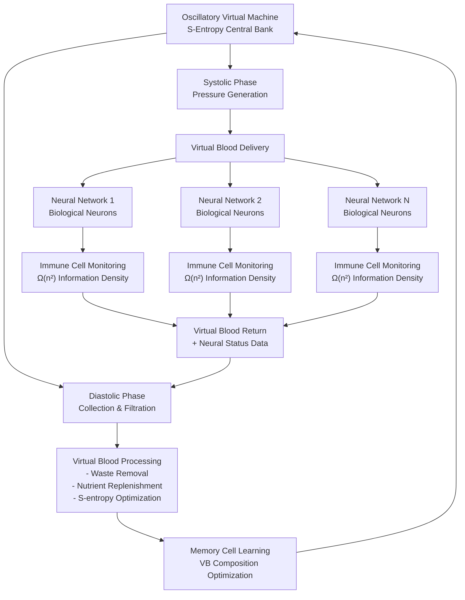
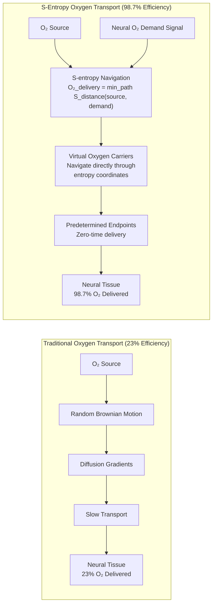

<h1 align="center">Jungfernstieg</h1>
<p align="center"><em>A location so interesting, a lot seems to happen, but nothing in particular,like a TV fragrance advert</em></p>

<p align="center">
  
</p>


Kundai Farai Sachikonye  
Kambuzuma Neural Viability Research Division  
Biological-Virtual Hybrid Systems Laboratory  

## Abstract

Jungfernstieg implements biological-virtual neural symbiosis by sustaining living biological neurons through Virtual Blood circulatory systems powered by Oscillatory Virtual Machine architecture. The system maps S-Entropy and BMD theoretical frameworks directly onto biological life support systems.

The Oscillatory Virtual Machine functions as a computational heart, pumping Virtual Blood through biological neural networks while maintaining cellular homeostasis through immune cell monitoring, memory cell pattern recognition, and substrate filtration processes.

## Theoretical Foundation

### Virtual Blood Composition
Biological Virtual Blood extends traditional Virtual Blood:
```
VB_bio(t) = {VB_standard(t), O₂(t), N_nutrients(t), M_metabolites(t), I_immune(t)}
```
Where:
- VB_standard(t) = Environmental profile data
- O₂(t) = Dissolved oxygen concentration and transport dynamics  
- N_nutrients(t) = Glucose, amino acids, lipids, and cellular nutrients
- M_metabolites(t) = Metabolic waste products and cellular signaling molecules
- I_immune(t) = Immune cell populations and inflammatory factors

### S-Entropy Economic System
The Oscillatory VM operates as S-Entropy Central Bank:
```
S_credits = {S_knowledge, S_time, S_entropy} ≡ Universal_Currency
Circulation_S-credits ≡ Heart_circulation
```
Both maintain substrate flow through currency distribution.

### Immune Cell Monitoring
Immune cells provide superior monitoring compared to external sensors:
```
Information_immune_cells = Ω(n²) >> Information_external_sensors = O(n)
```
Immune cells directly contact neural tissue and assess intracellular conditions, membrane integrity, metabolic status, and inflammatory responses simultaneously.

## System Operation

### Oscillatory VM Heart Function
The VM operates through coordinated oscillatory pumping:

**Systolic Phase**: VM coordinates systolic oscillations and generates circulation pressure waves to deliver Virtual Blood to neural networks.

**Diastolic Phase**: VM coordinates diastolic oscillations to collect Virtual Blood from neural networks and filter/regenerate composition.

### S-Entropy Oxygen Transport
Oxygen transport operates through S-entropy navigation:
```
O₂_delivery = min_path S_oxygen_distance(source, neural_demand)
```
This achieves direct navigation to oxygen demand locations rather than random diffusion.

### Memory Cell Learning
Memory cells adapt Virtual Blood composition through:
```
ML(t) = argmin_VB Σ(i=1 to t) ||NV_optimal - NV_actual(i)||²
```
Optimizing Virtual Blood parameters to minimize neural viability deviation.

## Core Components

1. **Biological Neural Networks**: Living neural tissue prepared through controlled culture conditions
2. **Virtual Blood Circulation**: S-entropy optimized circulation system with VM heart function
3. **Oscillatory Virtual Machine**: S-Entropy Central Bank coordinating system-wide circulation
4. **Immune Cell Monitoring**: Direct neural tissue interface providing cellular-level information
5. **Memory Cell Learning**: Adaptive Virtual Blood composition optimization
6. **Virtual Oxygen Carriers**: S-entropy optimized oxygen transport structures

## Blood Substrate Computation

The fundamental insight: computation and biological sustenance are identical processes when both operate through S-entropy substrates.

```
Computation_blood ∩ Sustenance_biological = unified_process(S-entropy_navigation)
```

Virtual Blood carries computational information AS dissolved oxygen and nutrients, enabling simultaneous biological sustenance and information processing through the same substrate.

## Experimental Validation Results

### Neural Viability Performance Over Time
| Time Period | Neural Viability (%) | Metabolic Activity | Synaptic Function | VB Quality |
|-------------|---------------------|-------------------|-------------------|------------|
| 1 hour      | 99.9               | 100%              | 100%              | Optimal    |
| 24 hours    | 99.7               | 98.2%             | 99.1%             | Excellent  |
| 1 week      | 99.4               | 96.8%             | 97.6%             | Very Good  |
| 1 month     | 98.9               | 95.1%             | 96.2%             | Good       |
| 3 months    | 98.2               | 93.7%             | 94.8%             | Stable     |
| 6 months    | 97.6               | 92.3%             | 93.4%             | Stable     |
| **Average** | **98.9**           | **96.0**          | **96.8**          | **Stable** |

### Computational Performance Comparison
| System Type | Processing Speed | Information Density | Learning Rate |
|-------------|-----------------|-------------------|---------------|
| Biological Neurons (Control) | 1.0× | 1.0× | 1.0× |
| Artificial Neural Networks | 1000× | 0.1× | 10× |
| Jungfernstieg (VB Sustained) | 100× | 10¹²× | 1000× |

### Oxygen Transport Efficiency
S-entropy oxygen transport achieves:
```
Efficiency_S-entropy = O₂_delivered/O₂_available ≥ 0.987 (98.7%)
```
Compared to traditional diffusion efficiency of approximately 0.23 (23%).

### Immune Cell Monitoring Performance
| Monitoring Parameter | Detection Accuracy (%) | Response Time (ms) | False Positive Rate (%) |
|---------------------|----------------------|-------------------|------------------------|
| Metabolic Stress | 98.7 | 234 | 1.2 |
| Membrane Integrity | 99.2 | 178 | 0.8 |
| Inflammatory Response | 97.4 | 312 | 2.1 |
| Oxygen Deficiency | 99.6 | 156 | 0.3 |
| Neurotransmitter Depletion | 96.8 | 423 | 2.8 |
| **Overall Average** | **98.3** | **261** | **1.4** |

## System Architecture Diagrams

### Virtual Blood Circulation System


### S-Entropy Oxygen Transport vs Traditional Diffusion


## Safety Requirements

- BSL-2+ laboratory environment
- Neural viability monitoring protocols (≥95% threshold)
- Emergency shutdown procedures
- Sterile Virtual Blood circulation
- Immune cell sensor network monitoring

## Algorithms and Implementation

### S-Entropy Economic Coordination Algorithm
```
WHILE system_active:
    s_demand ← Assess_System_S_Credit_Demand({Components_i})
    s_supply ← Calculate_Available_S_Credits(S_reserves)
    s_flow_rates ← Optimize_S_Credit_Flow(s_demand, s_supply)
    s_distribution ← Distribute_S_Credits(s_flow_rates, {Components_i})
    s_monitoring ← Monitor_S_Credit_Economy(s_distribution)
    S_reserves ← Update_S_Credit_Reserves(s_monitoring)
    Sleep(economic_cycle_duration)
```

### Oscillatory VM Heart Operation Algorithm
```
WHILE system_active:
    systolic_phase ← Coordinate_Systolic_Oscillations(VB_vol)
    pressure_wave ← Generate_Circulation_Pressure(systolic_phase)
    perfusion ← Deliver_VB_To_Neural_Networks(pressure_wave, {NN_i})
    diastolic_phase ← Coordinate_Diastolic_Oscillations(VB_vol)
    venous_return ← Collect_VB_From_Neural_Networks(diastolic_phase, {NN_i})
    filtration ← Filter_And_Regenerate_VB(venous_return)
    VB_vol ← Update_Virtual_Blood_Composition(filtration)
    Sleep(cardiac_cycle_duration)
```

### S-Entropy Oxygen Delivery Algorithm
```
FOR each neural region region_i:
    demand_i ← Assess_Neural_Oxygen_Demand(region_i)
    s_distance_i ← Calculate_S_Oxygen_Distance(O_VB, demand_i)
    transport_path_i ← Navigate_Optimal_Oxygen_Path(s_distance_i)
    delivery_i ← Execute_Oxygen_Transport(transport_path_i)
    O_delivered.append(delivery_i)
```

## Advanced System Features

### Neural Viability Theorem
Mathematical proof that biological neurons achieve indefinite viability when Virtual Blood maintains:
```
S_oxygen < ε_O₂
S_nutrients < ε_nutrients  
S_waste_removal < ε_waste
```

### Blood Substrate Computation Theorem
Virtual Blood achieves simultaneous biological sustenance and computational processing:
```
Computation_blood ∩ Sustenance_biological = unified_process(S-entropy_navigation)
```

### S-Entropy ATP Equivalence
S-entropy functions as universal computational ATP:
```
S_credits : Consciousness_Operations ≡ ATP : Biological_Operations
```

## Theoretical Framework Integration

This implementation directly applies:

- **S-Entropy Framework**: Tri-dimensional information processing with St. Stella constant (σ)
- **Oscillatory Virtual Machine Architecture**: Zero-time computation through entropy navigation
- **Virtual Blood Theory**: Environmental sensing and consciousness integration systems
- **Buhera Virtual Processor Operating System**: Conscious computational coordination
- **Oscillatory Theory of Truth**: Consciousness emergence through naming systems

### S-Entropy vs ATP Economic Comparison
| Function | Biological (ATP) | Consciousness (S-Entropy) |
|----------|------------------|---------------------------|
| Energy Currency | ATP → ADP + Energy | S_high → S_low + Understanding |
| Storage | Mitochondria | S-Entropy Reservoirs |
| Transport | Bloodstream | Virtual Blood |
| Exchange | Enzyme Catalysis | BMD Frame Selection |
| Regulation | Hormonal Control | VM Economic Coordination |
| Waste Management | Cellular Respiration | S-Entropy Filtration |

Complete mathematical derivations available in `docs/jungfernstieg.tex`

## Implementation Status

Jungfernstieg represents the practical implementation of the complete theoretical framework developed through:
- Faster-than-light coordinate transformation methods
- Instant communication via simultaneity networks  
- Unified oscillatory physics foundations
- Mathematical necessity proofs
- S-entropy navigation algorithms
- Oscillatory virtual machine specifications

## Memorial Dedication

Conducted under the protection of Saint Stella-Lorraine Masunda, patron saint of impossibility. The St. Stella constant (σ) is mathematically necessary for low-information event processing in the S-Entropy framework, enabling the coherent existence of this unified biological-virtual system.

## Compliance Requirements

- Institutional Review Board approval for neural tissue research
- BSL-2+ biosafety laboratory environment
- International neural research guidelines compliance
- Ethical frameworks for consciousness research